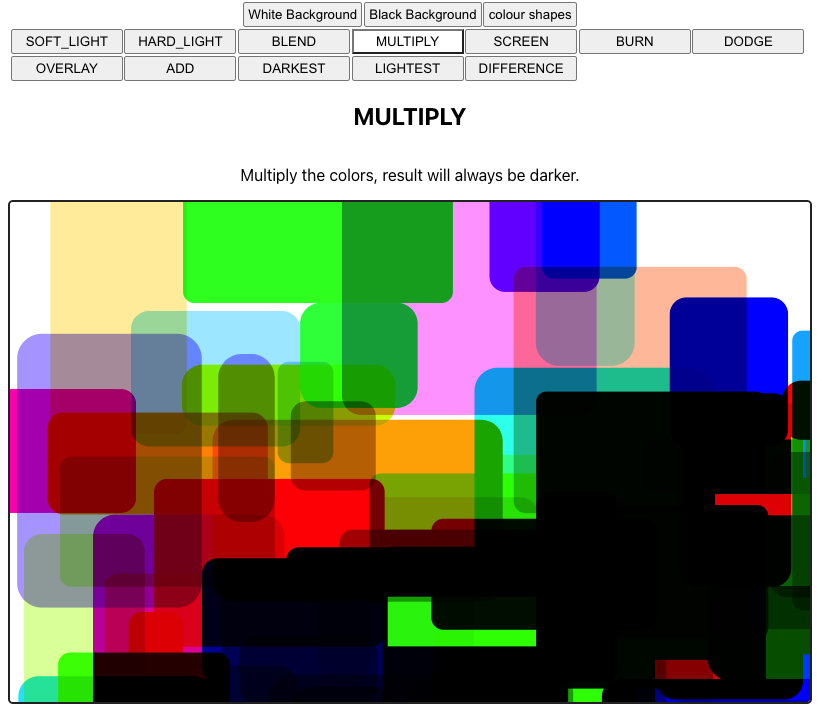

# React + p5.js blend mode demonstrator

This is a React + p5.js app which demonstrates blend modes.

It uses [react-p5-wrapper](https://github.com/P5-wrapper/react) to integrate React and p5.js.
It is written in TypeScript.

There also exists a plain p5.js version of this Blend Mode Demo app, [source here](https://github.com/nbogie/p5js-blend-modes-demo), and [live here](https://nbogie.github.io/p5js-blend-modes-demo/).

(This react version was primarily ported from the plain p5.js version to test out react-p5-wrapper.)

---

The React app is bootstrapped with Create React App. [Read the original Create React App docs](./README_CRA.md)
